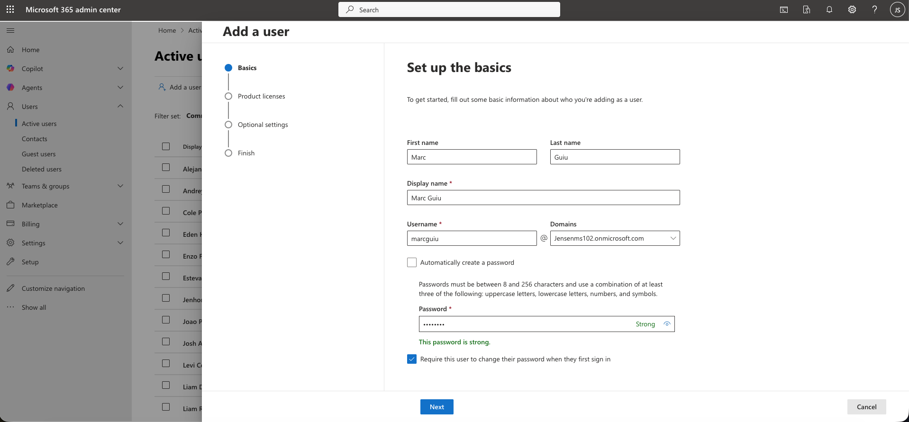

# Lab 01 - New User Onboarding in Microsoft 365

## Table of Contents
- [Overview](#overview)
- [Scenario](#scenario)
- [Objectives](#objectives)
- [Tools and Services Used](#tools-and-services-used)
- [Administrative Workflow](#administrative-workflow)
- [Expected Outcome](#expected-outcome)
- [Security Considerations](#security-considerations)
- [Common Issues and Troubleshooting](#common-issues-and-troubleshooting)
- [What I Learned](#what-i-learned)

## Overview
This lab simulates the onboarding process for a new employee in a Microsoft 365 environment.

The purpose of this project is to demonstrate the basic administrative workflow involved in preparing a new user account, assigning access, and applying basic security controls.

## Scenario
A small business has hired a new employee who needs access to Microsoft 365 services such as Outlook, Teams, and OneDrive.

As the IT administrator, I need to prepare the account and make sure the user can securely access the required services on their first day.

## Objectives
- Create a new user account in Microsoft 365
- Assign the appropriate license
- Add the user to the correct group
- Configure authentication readiness for secure account access
- Understand the basic user onboarding workflow
- Practice documentation using a real-world admin scenario

## Tools and Services Used
- Microsoft 365 Admin Center
- Microsoft Entra Admin Center
- Microsoft 365 user management
- License assignment
- Multi-Factor Authentication (MFA)
- GitHub documentation

> Note: This is a simulated lab project created for learning and portfolio purposes.

## Administrative Workflow
### Step 1: Create the New User Account
- Open Microsoft 365 Admin Center
- Go to Users > Active users
- Select **Add a user**
- Enter the employee's name, display name, and username
- Set an initial password and require password change at first sign-in
- Configure optional profile details such as job title, department, and location

### Step 2: Assign a Microsoft 365 License
- Assign a Microsoft 365 license to the new user
- Confirm access to core productivity and collaboration services, including Microsoft Teams, Outlook, and Microsoft 365 apps
- Review the included services, and the new user info
- Click Finish adding

> Note: In a production environment, license services should be reviewed and adjusted according to the user’s job role and business requirements.

### Step 3: Add the User to the Appropriate Group
- In the Microsoft 365 Admin Center, go to **Teams & groups** > **Active teams & groups**
- Select the appropriate group for the employee, such as **Sales**
- Open the group membership settings and add the new user
- Verify that the user is now a member of the selected group

This step helps assign collaboration access and organize users based on their department or role.

### Step 4: Review Authentication Settings
- In the Microsoft Entra admin center, opened the new user account
- Navigate to **Authentication methods**
- Review the user’s current authentication status and confirmed that no methods were registered yet
- Add **Temporary Access Pass (TAP)** as a temporary sign-in method (choose from Email, Phone Number, Temporary Access Pass, or QR code)
- Confirm that TAP can be used by the new user during first sign-in to begin secure account setup

This step supports secure onboarding by providing a temporary authentication method before the user registers stronger authentication methods.

> Note: Temporary Access Pass is useful during onboarding because it allows a new user to sign in and register additional authentication methods securely.

### Step 5A: Verify Access Status from the Admin Side
- Review the new user account in the Microsoft 365 Admin Center
- Confirm that the account was created successfully
- Confirm that the Microsoft 365 license was assigned
- Confirm that the user was added to the appropriate group
- Confirm that Temporary Access Pass (TAP) was configured as part of the onboarding process

### Step 5B: Verify Access Status from the New User Side
- Open **office.com** and test the first sign-in flow using the new user account
- Enter the new user’s work email address
- Use **Temporary Access Pass (TAP)** to complete the initial sign-in process
- Complete the Microsoft Authenticator registration steps when prompted
- Confirm that the user was able to sign in successfully after the setup process

This step helped verify that the account was fully prepared from the end-user perspective, not only from the administrator side.

> Note: During this lab, the first sign-in used Temporary Access Pass (TAP) instead of the account password. Because of that, the password change requirement applied during a later sign-in rather than the initial TAP-based sign-in.

## Expected Outcome
At the end of this lab:
- The new employee account is created
- A valid Microsoft 365 license is assigned
- Group membership is configured
- The user is prepared to complete secure sign-in and authentication setup
- The user is ready for first sign-in

## Security Considerations
- MFA should be enabled to reduce the risk of account compromise
- Access should follow the principle of least privilege
- Only the required license and permissions should be assigned
- Administrative roles should not be granted unless necessary

## Common Issues and Troubleshooting
### Issue 1: User cannot sign in
Possible causes:
- Incorrect username
- Wrong temporary password
- Account provisioning is not yet complete

### Issue 2: Microsoft 365 apps are unavailable
Possible causes:
- License was not assigned
- Services are still provisioning
- Wrong license type was selected

### Issue 3: MFA setup fails
Possible causes:
- MFA registration was not completed
- Authentication method was not configured correctly
- User needs additional setup guidance

## What I Learned
This lab helped me understand that onboarding in Microsoft 365 involves more than creating a user account and assigning a license.

I learned how account creation, licensing, group membership, and authentication setup work together as part of a secure onboarding workflow. I also verified the process from the end-user side by testing the first sign-in experience with Temporary Access Pass (TAP) and Microsoft Authenticator registration.
