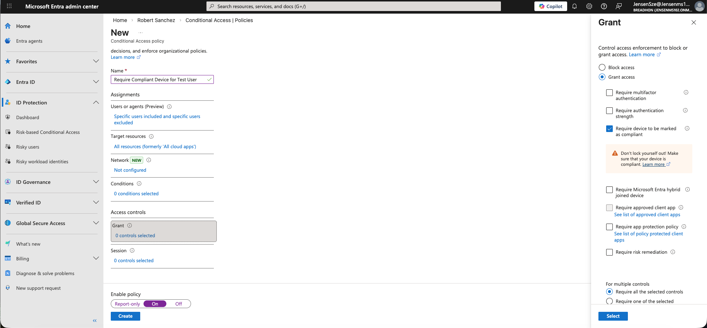
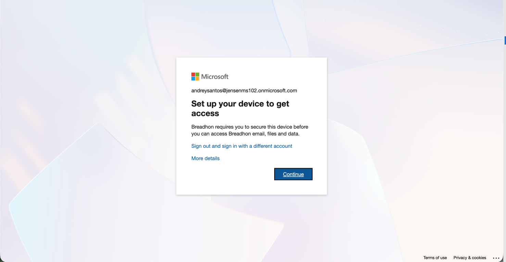

# Lab 05 - Conditional Access and Device Compliance in Microsoft 365

## Table of Contents
- [Overview](#overview)
- [Scenario](#scenario)
- [Objectives](#objectives)
- [Tools and Services Used](#tools-and-services-used)
- [Administrative Workflow](#administrative-workflow)
- [Expected Outcome](#expected-outcome)
- [Security Considerations](#security-considerations)
- [Common Issues and Troubleshooting](#common-issues-and-troubleshooting)
- [What I Learned](#what-i-learned)

## Overview
This lab simulates the process of using Conditional Access to restrict access based on device compliance in a Microsoft 365 environment.

The purpose of this project is to demonstrate how administrators can use Conditional Access policies to require a compliant device before allowing access to organizational resources.

## Scenario
A small business wants to improve access control by allowing Microsoft 365 access only from devices that meet organizational compliance requirements.

As the IT administrator, I need to review Conditional Access options, create a policy that requires a compliant device, and document how device-based access control can improve security.

## Objectives
- Review Conditional Access options related to device-based access control
- Create a Conditional Access policy that requires a compliant device
- Apply the policy to a test user
- Understand the relationship between Conditional Access and device compliance
- Practice documentation using a real-world identity and access control scenario

## Tools and Services Used
- Microsoft Entra Admin Center
- Conditional Access
- Microsoft Entra ID P1
- GitHub documentation

## Administrative Workflow
### Step 1: Review Conditional Access Options for Device Compliance
- Open Microsoft Entra Admin Center
- Go to **Conditional Access** > **Policies**
- Review Conditional Access policy options related to device-based access control
- Confirm that the tenant is ready to create another Conditional Access policy for testing

### Step 2: Create a Conditional Access Policy for Device Compliance
- Select **New policy**
- Enter a policy name such as **Require Compliant Device for Test User**
- Under **Assignments** > **Users**, select a single test user account
- Exclude the administrator account to avoid accidental lockout during testing

### Step 3: Configure Device Compliance Grant Controls
- Under **Target resources**, select **All resources**
- Leave additional conditions unconfigured for this basic test
- Under **Grant**, select **Grant access**
- Enable **Require device to be marked as compliant**
- Set the policy state to **On**
- Create and enable the policy

### Step 4: Verify the Access Control Result from the User Side
- Open **office.com** and attempt to sign in using the test user account
- Observe that the user was prompted to set up the device before access could be granted
- Confirm that the device does not meet the required access conditions
- Verify that access was denied when the device was not compliant or properly managed

This step helped confirm that the Conditional Access policy successfully restricted access from a non-compliant or unmanaged device.

> Note: To allow access under a policy that requires a compliant device, the device would typically need to be registered in Microsoft Entra ID, enrolled in Microsoft Intune, and evaluated against a compliance policy before it can be marked as compliant.

## Expected Outcome
At the end of this lab:
- A Conditional Access policy is created successfully
- The policy applies to a selected test user
- Device compliance is configured as a required access control
- The policy is enabled successfully
- Access from a non-compliant or unmanaged device is restricted
- The relationship between Conditional Access and device compliance is documented

## Security Considerations
- Device-based access control helps reduce the risk of access from unmanaged or untrusted devices
- Conditional Access policies should be tested with a limited user scope before wider rollout
- Administrator accounts should be excluded from initial testing to avoid accidental lockout
- Requiring a compliant device is most effective when supported by device registration, enrollment, and compliance policies
- Access controls should balance security needs with operational usability

## Common Issues and Troubleshooting

### Issue 1: The compliant device option is unavailable
Possible causes:
- Required licensing or configuration is missing
- Device compliance integration is not fully configured
- The tenant is not connected to the expected device management workflow

### Issue 2: The policy does not behave as expected
Possible causes:
- The wrong user was selected in the policy assignment
- The policy is not enabled
- The sign-in attempt does not match the intended policy scope

### Issue 3: Access is blocked unexpectedly
Possible causes:
- The device is not marked as compliant
- The user is testing from an unmanaged device
- The policy scope is too broad during testing

### Issue 4: Device compliance cannot be verified in the lab
Possible causes:
- No managed device is enrolled for testing
- Compliance status is not available in the current environment
- The lab is limited to policy creation and expected behavior review

## What I Learned
I learned how to create a Conditional Access policy that uses device compliance as an access control requirement.

This lab also helped me understand how Conditional Access and device compliance work together to protect Microsoft 365 resources from access by unmanaged or non-compliant devices.
